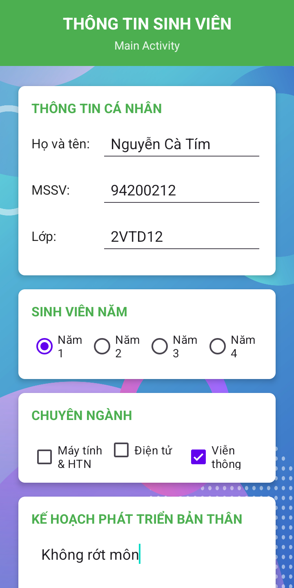
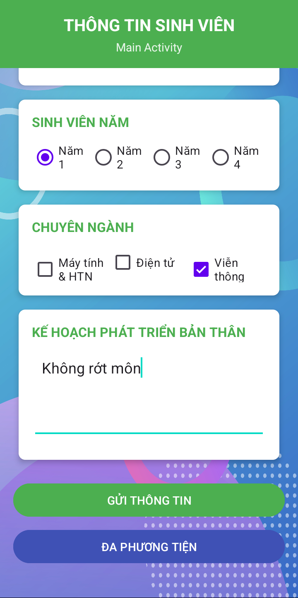
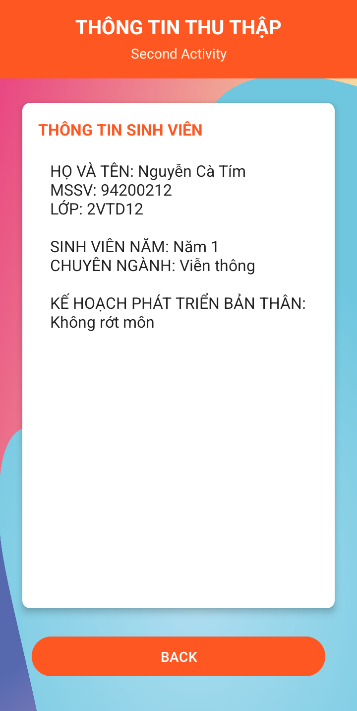
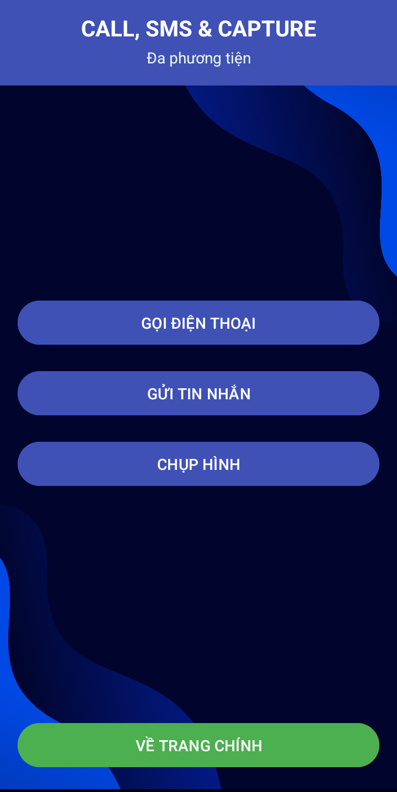
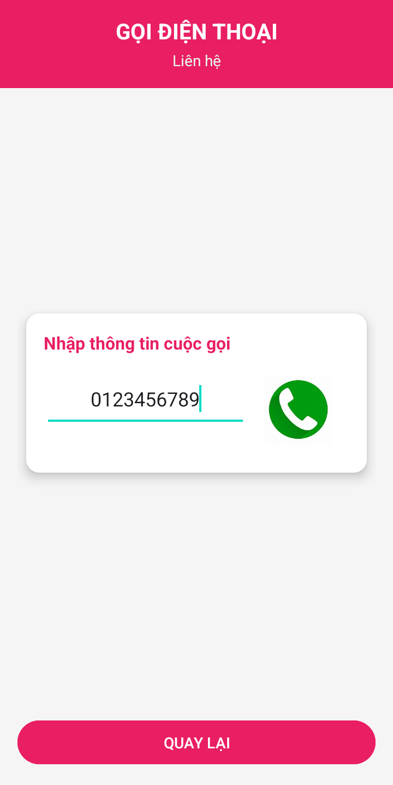
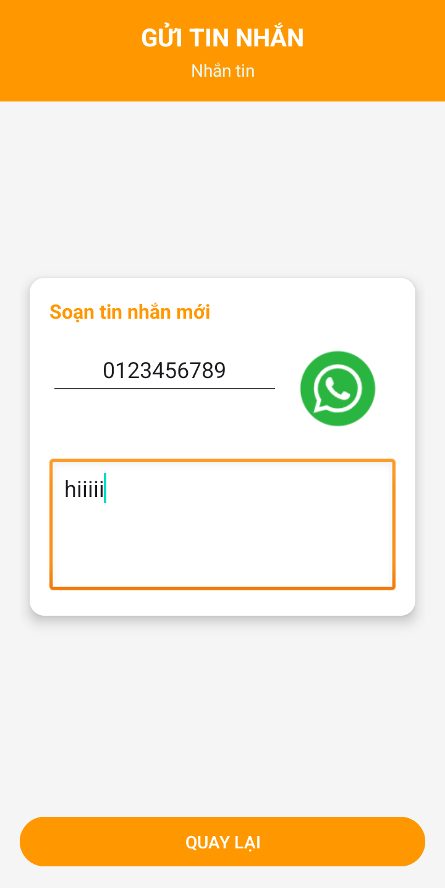
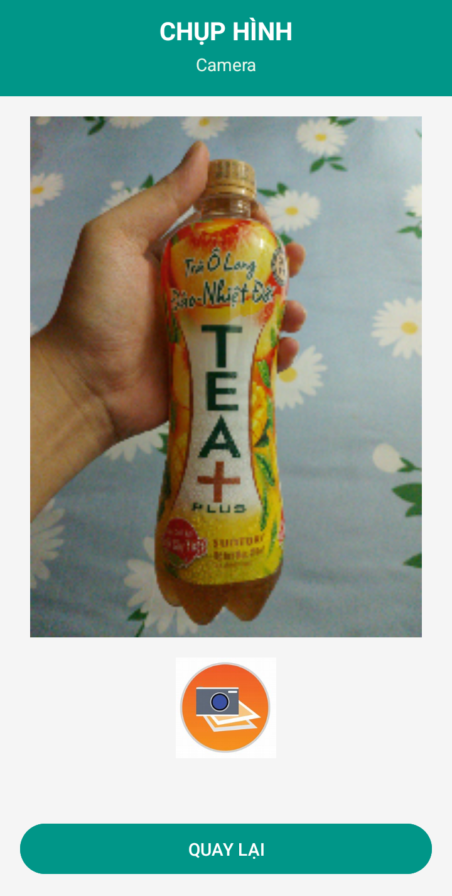

# Ứng dụng Thông tin Sinh viên và Đa phương tiện

Ứng dụng Android đa chức năng giúp sinh viên nhập và hiển thị thông tin cá nhân, đồng thời tích hợp các tính năng đa phương tiện như gọi điện thoại, gửi tin nhắn SMS và chụp ảnh từ camera.

## Mô tả

Ứng dụng "Thông tin Sinh viên và Đa phương tiện" được phát triển dựa trên [ứng dụng Thông tin Sinh viên gốc](https://github.com/Eggplant203/Nhap-thong-tin-sinh-vien) với việc bổ sung thêm các tính năng đa phương tiện. Ứng dụng bao gồm nhiều màn hình chức năng:

- **Màn hình Nhập thông tin**: Nơi sinh viên nhập thông tin cá nhân, năm học, chuyên ngành và kế hoạch phát triển bản thân
- **Màn hình Hiển thị thông tin**: Nơi hiển thị tất cả thông tin đã được nhập từ màn hình đầu tiên
- **Màn hình Đa phương tiện**: Trung tâm điều hướng đến các chức năng gọi điện thoại, gửi tin nhắn và chụp ảnh
- **Màn hình Gọi điện thoại**: Cho phép nhập số điện thoại và thực hiện cuộc gọi
- **Màn hình Gửi tin nhắn**: Cho phép nhập số điện thoại, soạn nội dung và gửi tin nhắn SMS
- **Màn hình Chụp ảnh**: Cho phép chụp ảnh bằng camera và hiển thị ảnh vừa chụp

Ứng dụng sử dụng kiến thức về vòng đời Activity, Intent, xử lý quyền người dùng và tương tác với các API hệ thống của Android để cung cấp trải nghiệm người dùng toàn diện.

## Tính năng chính

- **Quản lý thông tin sinh viên**:
  - Thu thập thông tin cá nhân (họ tên, MSSV, lớp)
  - Lựa chọn năm học (Năm 1, 2, 3 hoặc 4) bằng RadioButton
  - Chọn chuyên ngành (có thể chọn nhiều) bằng CheckBox
  - Nhập kế hoạch phát triển bản thân qua trường văn bản đa dòng
  - Kiểm tra tính hợp lệ của dữ liệu trước khi gửi
  - Hiển thị tất cả thông tin đã nhập trên màn hình thứ hai

- **Chức năng đa phương tiện**:
  - Gọi điện thoại trực tiếp từ ứng dụng
  - Soạn và gửi tin nhắn SMS
  - Chụp ảnh bằng camera thiết bị và xem lại ngay lập tức

## Hình ảnh minh họa

### Màn hình thông tin sinh viên

| Nhập thông tin (Phần 1) | Nhập thông tin (Phần 2) | Hiển thị thông tin |
|:-------------:|:----------------:|:----------------:|
|  |  |  |

### Màn hình đa phương tiện

| Đa phương tiện | Gọi điện thoại | Gửi tin nhắn | Chụp ảnh |
|:-------------:|:----------------:|:----------------:|:----------------:|
|  |  |  |  |

## Cấu trúc ứng dụng

Ứng dụng bao gồm các activity chính sau:

1. **MainActivity**: Màn hình cho sinh viên nhập thông tin cá nhân và học tập
2. **SecondActivity**: Màn hình hiển thị tất cả thông tin đã nhập
3. **DaPhuongTienActivity**: Màn hình trung tâm cho các chức năng đa phương tiện
4. **PhoneActivity**: Màn hình gọi điện thoại
5. **SMSActivity**: Màn hình gửi tin nhắn SMS
6. **CameraActivity**: Màn hình chụp ảnh và xem lại ảnh vừa chụp

## Luồng dữ liệu và tương tác

1. **Quản lý thông tin sinh viên**:
   - Sinh viên nhập thông tin cá nhân, chọn năm học, chuyên ngành và kế hoạch phát triển
   - Khi nhấn nút "GỬI THÔNG TIN", dữ liệu được kiểm tra tính hợp lệ
   - Nếu dữ liệu hợp lệ, thông tin được gửi đến SecondActivity (REQUEST_CODE: 99)
   - SecondActivity hiển thị thông tin đã nhập
   - Khi nhấn nút "BACK", người dùng quay lại MainActivity (RESULT_CODE: 88)

2. **Tương tác đa phương tiện**:
   - Từ MainActivity, người dùng có thể chọn "ĐA PHƯƠNG TIỆN" để mở DaPhuongTienActivity
   - Từ đây, người dùng có thể chọn một trong ba chức năng: Gọi điện thoại, Gửi tin nhắn, hoặc Chụp ảnh
   - Mỗi chức năng sẽ mở một Activity riêng biệt với giao diện phù hợp
   - Các quyền cần thiết (gọi điện thoại, gửi SMS, sử dụng camera) được yêu cầu khi cần

## Yêu cầu quyền

Ứng dụng yêu cầu các quyền sau để hoạt động đầy đủ:
- `CALL_PHONE`: Cho phép thực hiện cuộc gọi trực tiếp từ ứng dụng
- `SEND_SMS`: Cho phép gửi tin nhắn SMS từ ứng dụng
- `CAMERA`: Cho phép truy cập camera để chụp ảnh

## Yêu cầu hệ thống

- Android 14.0 (API level 34 - "UpsideDownCake") hoặc cao hơn
- Android Studio
- Thiết bị có camera, khả năng gọi điện và gửi tin nhắn SMS

## Cách cài đặt

1. Clone repository này về máy local
2. Mở dự án bằng Android Studio
3. Sync Gradle và build project
4. Chạy ứng dụng trên thiết bị thật (khuyến nghị sử dụng thiết bị thật thay vì máy ảo để có thể sử dụng đầy đủ các tính năng)

## Công nghệ sử dụng

- Java
- Android SDK
- LinearLayout, ScrollView và CardView
- Activity Lifecycle và Intent
- RadioGroup, CheckBox và EditText
- Xử lý quyền người dùng với ActivityCompat
- Camera API
- Telephony API cho cuộc gọi và SMS

## Thiết kế giao diện

- Sử dụng CardView để tạo giao diện hiện đại, có bóng đổ
- Phối màu đa dạng và nhất quán: xanh lá (#4CAF50) cho MainActivity, đỏ cam (#FF5722) cho SecondActivity, xanh dương (#3F51B5) cho DaPhuongTienActivity, hồng (#E91E63) cho PhoneActivity, cam (#FF9800) cho SMSActivity và xanh ngọc (#009688) cho CameraActivity
- Tiêu đề và nhãn được làm nổi bật với chữ in đậm
- ScrollView cho phép cuộn khi nội dung vượt quá kích thước màn hình
- Hình nền tùy chỉnh cho mỗi màn hình

## Giấy phép

Dự án được phân phối dưới giấy phép MIT. Xem file `LICENSE` để biết thêm chi tiết.

## Tác giả

© 2025 - Được phát triển bởi Eggpant203 🍆

---

_Lưu ý: Đây là dự án học tập, nhằm mục đích thực hành các kỹ năng lập trình Android cơ bản và tương tác với các API hệ thống. Mọi đóng góp và phản hồi đều được chào đón._